# 绝望之旅
## 武器强化机
*Note: 如果这是你第一次玩, 我强烈建议你先熟悉一下这艘船(地图)。 至少你得很轻松的知道如何从出生地到引擎室的路线。 然后再尝试去解锁这张图的任务彩蛋。*

当你进入这张地图时，你会出生在船头。 你的第一个目标就是需要打开路上各种各样的门到达船尾（船尾甲板）。 当你接近船尾时，你应该会发现神器在船尾的小道上（一般发着很亮的光）。 你需要爬上小道，然后对着<imageLink title="神器"></imageLink> 进行 交互（按`F`），然后就会解锁船上的封锁区域，开始你的彩蛋步骤。

船上会出现4个刻有炼金元素符号的面板，关于元素符号详情，请查看<videoLink title="视频教程"><source src="./video/pap.mp4"/></videoLink>。
- <imageLink title="船尾甲板 (地元素)">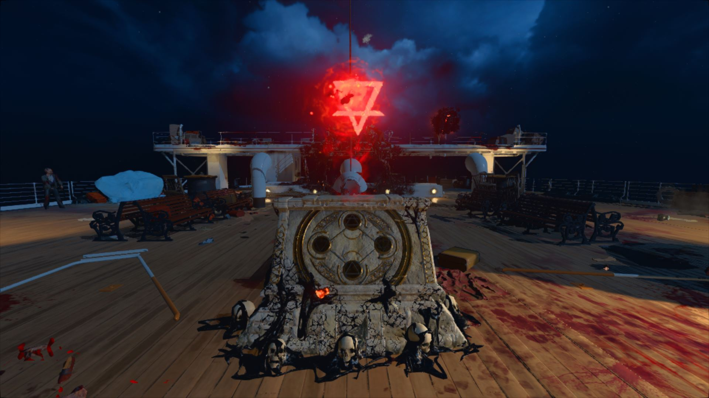</imageLink>
- <imageLink title="涡轮室 (火元素)">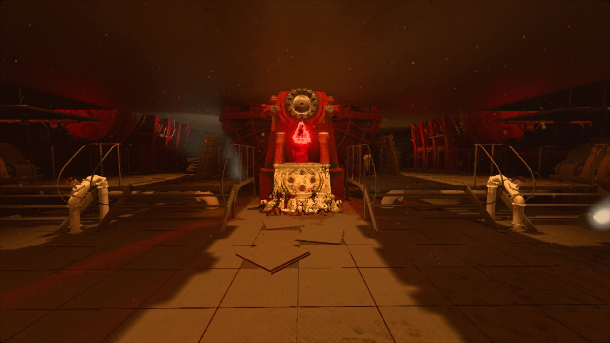</imageLink>
- <imageLink title="大旋梯底层 (气元素)">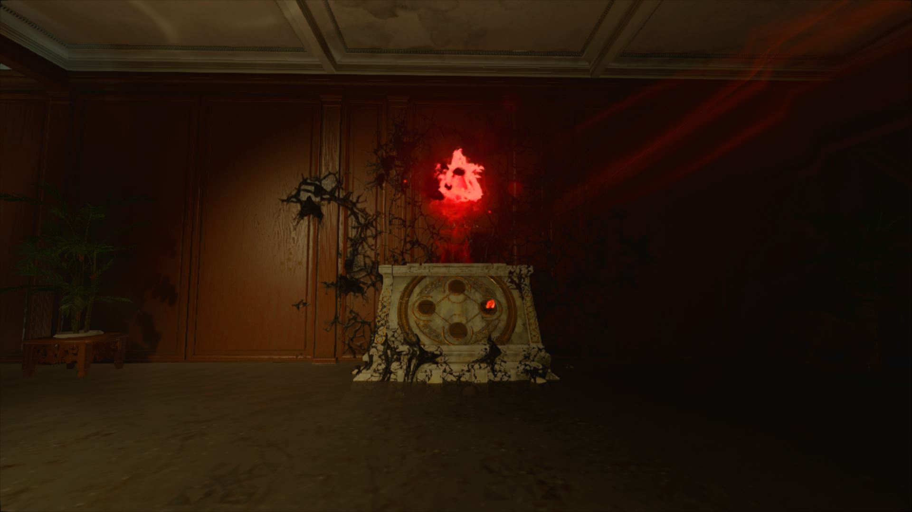</imageLink>
- <imageLink title="货仓 (水元素)"></imageLink>

第一个刻有炼金元素符号的面板就位于你刚刚互动的神器附近. 与其互动来解锁它. 当你解锁了所有4个炼金元素面板时，强化机就会立刻出现在你最后激活的面板上。 注意：强化机并不是一直固定在一个地方, 每过两波就会进行一次随机移动。
::: tip 快速定位强化机的位置
你可以前往随意一个炼金元素符号的面板前，你会看到对应的炼金符号亮起，亮起的符号代表着强化机目前所处的位置。

如果你熟悉炼金元素符号的含义和对应的位置，就可以前往寻找强化机

每个元素都关联了对应的位置 (参考[时钟步骤](#时钟)).

如果您看不懂也没有关系，你也可以走进炼金元素符号的面板，强化机的位置也会显示在屏幕上。
:::
::: tip 将强化机解锁在所有区域
一旦你拥有了元素海怪，你也许已经完成了强化机的解锁。 如果你还没有海怪，可以前往[海怪获取指南](#海怪) 和[元素海怪强化指南](#元素蒸馏器).

在引擎室中间，你可以使用海怪射击4个移动 位置 然后他们会停止移动并开始冒烟.

活塞上方有几个 红色的阀门 和在他们的上面的<imageLink title=" 灯光">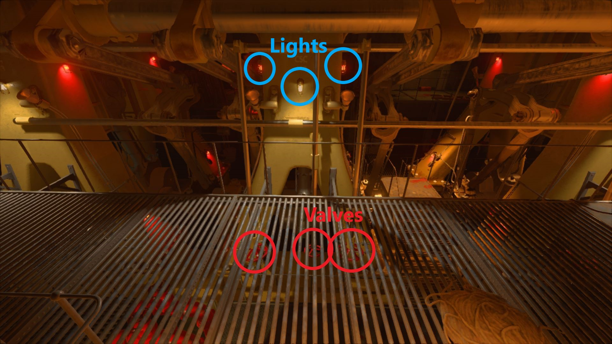</imageLink>(每个地方有3个, 一共12个). 抬头看着闪烁着灯光的灯并转动阀门 灯光可能会是白色或者红色. 如果发现阀门无法转动，请试着长按互动键 (电脑键盘为`F`键) . 你必须转动面朝灯光的阀门. 非闪烁灯下方的杆必须朝灯方向转动。

应该有六个闪光灯。 一旦6个阀门完成了转动, 走进涡轮室然后向右看。 靠墙的地方会有一个<imageLink title="拉杆">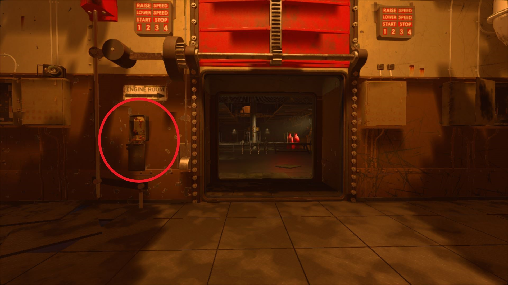</imageLink>. 将它拉下之后即可完成升级

新的强化机将会出现在所有地方, 使用 5000 点数来强化你的武器, 同时也会 将你强化的武器弹药填满. 这个效果只有**一波的时间**, 这一波过去之后强化机会回到正常的随机移动 状态。
:::
::: warning 注意
如果你在用[腐化海怪射击管道](#管道)步骤之前使用了这个彩蛋，可能会出现一些BUG：

强化机会恢复到随机的一个位置，而不会在引擎室灌满水之后移动到涡轮室。

当你在升级神器步骤的时候遇到了这个问题，你可能只能强行等待几波直到强化机自己移动到涡轮室才能强化神器。 所以最好是在所有管道被射击过后，涡轮室灌满水之后使用这个彩蛋，可以让强化机强行出现在涡轮室， 不必等下一波就可以直接强化神器。
:::
## 海怪
“海怪”是一种三管大炮，可以从神秘盒子中抽到。 它只能被强化机强化一次, 但它可以在引擎室的海怪元素蒸馏器里面进行二次强化（附加属性）。

想要获取 免费 海怪, 你必须找到海怪宝箱（海盗箱）。 箱子会随机出现在5个不同的位置中的一个。想要打开它，你需要击杀**添煤工** (手里拿着铲子的冒火僵尸) 然后捡起他掉落的钥匙。 一旦你拿到了钥匙，就可以前往打开箱子，并在附近击杀僵尸， 僵尸的灵魂会为箱子充能。

击杀数量足够之后，箱子会关闭，然后随机传送到其余的4个地点。 你必须重复这个过程两次。 一旦完成，箱子关闭数秒后会再次打开，里面会有一个物件。 如果该物品是指南针，则必须前往**船甲板**的阶梯附近。 如果该物品是望远镜，则必须前往**船尾甲板**神器初始位置附近。

当你到达箱子展示对应物品的正确位置附近时，会出现一个巨大的触手 将海怪扔在物品对应的位置上。 任何玩家都可以将其捡起，不论是谁完成了这个箱子彩蛋。
::: tip 海怪箱子位置
- 厨房 - 在厨房的角落里。位于符号和时钟的反面
- 冻库 - 肉类储藏柜。从船尾甲板前往到机舱时可以看到。
- <imageLink title="涡轮室"></imageLink> - 引擎室 强化机的位置，在强化机的右后方。
- <imageLink title="休息室">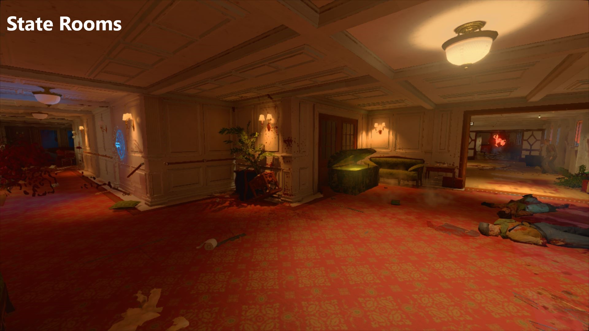</imageLink> - 在 靠近通往百万富翁套房的大楼梯的小入口。
- <imageLink title="邮件收发室 ">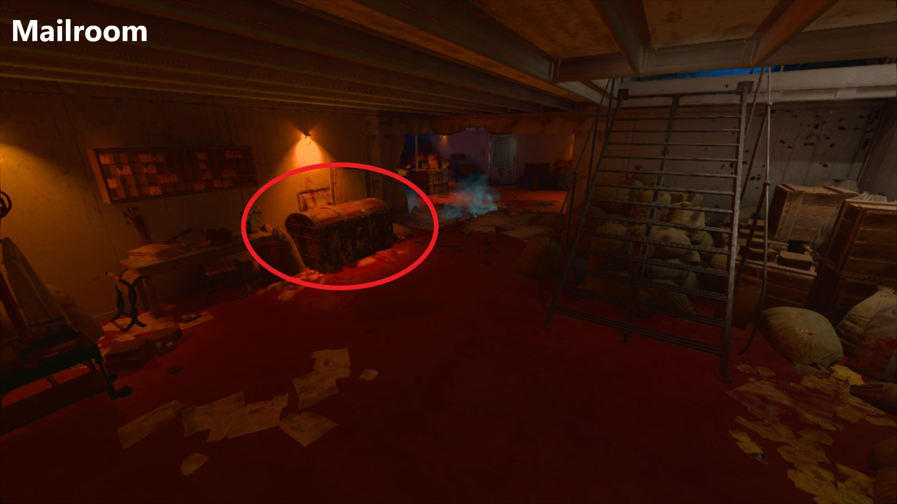</imageLink> - 在货舱前楼梯的右边。
:::
::: tip 物品/海怪掉落的位置
- <imageLink title="双筒望远镜"></imageLink>- <imageLink title="在船头">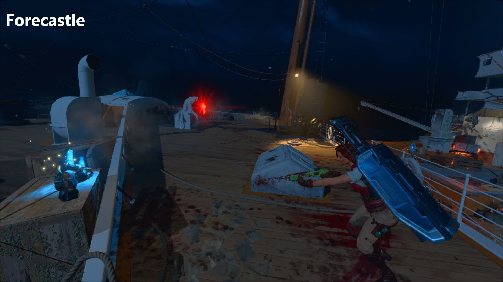</imageLink>也就是出生地; 达努神像上楼梯的后的左边。
- 罗盘 - 甲板的顶层，靠近大楼梯的顶部。
- 望远镜 - 船尾甲板。神器初始位置附近的区域。
- 地球仪 - 中部甲板，厨房到甲板的出口附近。
- 钳子 - 后甲板上。
:::
## 排水阀
当你到达引擎室和货仓区域时，你会发现里面被水灌满了。 你可以潜入水中寻找排水阀来将水排掉。
- <imageLink title="锅炉室 (引擎室)">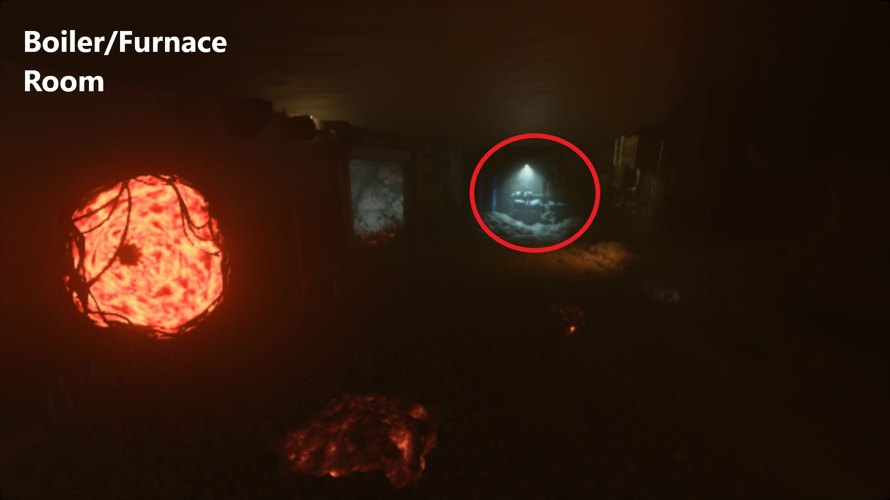</imageLink>
- <imageLink title="货仓区域"></imageLink>

一旦[射击管道](#管道)彩蛋完成, 这些地方将会被重新灌满水， 但是你可以再一次的使用排水阀将水排干。
## 时钟
查看[时钟和符号](#时钟和符号)章节来了解更多关于完成时钟彩蛋的信息

<vodClock/>

::: tip
你没有必要刻意去记忆时钟的位置。 当然，如果记错时间的话，知道时钟对应的位置可以帮助你更快的解决问题。
:::
### 时钟位置
时钟会出现在6个之中的4个随机位置。 要确定哪个时钟是有效的，你必须找到时钟附近出现的元素符号。 时钟和元素符号的组合在每一局游戏都是随机的，但是一旦出现就不会随着 波数和外界条件改变。
1. 邮件室
    - 时钟- 在货舱最右边入口的右手边。
    - 符号 - 在通向时钟的楼梯下面。在一些板条箱后面。
    - <imageLink title="对应图片位置"></imageLink>  丨  <videoLink title="视频教程"><source src="./video/time1.mp4"/></videoLink>
2. 舰桥室
    - 时钟- 在船舵正上方
    - 符号 - 在船舵右边的船长办公桌底下。
    - <imageLink title="对应图片位置"></imageLink>  丨  <videoLink title="视频教程"><source src="./video/time2.mp4"/></videoLink>
3. 大旋梯顶层
    - 时钟- 楼梯顶部的顶层，浮雕壁画中间。
    - 符号 -  在野火购买点左边的门上
    - <imageLink title="对应图片位置"></imageLink>  丨  <videoLink title="视频教程"><source src="./video/time3.mp4"/></videoLink>
4. 头等舱休息室
    - 时钟 - 就在宙斯祭坛的正对面。在壁炉架上。
    - 符号 - 在墙上时钟的右边。在抽奖盒子生成区域的左边。
    - <imageLink title="对应图片位置"></imageLink>  丨  <videoLink title="视频教程"><source src="./video/time4.mp4"/></videoLink>
5. 厨房
    - 时钟- 从餐厅进入时在房间的右侧。 在燃烧着的窗户右边的墙上。
    - 符号 - 从餐厅进入时在房间的右侧。 在房间中央的橱柜上。
    - <imageLink title="对应图片位置"></imageLink>  丨  <videoLink title="视频教程"><source src="./video/time5.mp4"/></videoLink>
6. 三等舱卧铺
    - 时钟 - 在小旋梯的底部。 在一个打开的窗口左边，里面有一个骨架。
    - 符号 - 在小旋梯的底部。 在一堆行李的后面 楼梯弯曲处.
    - <imageLink title="对应图片位置">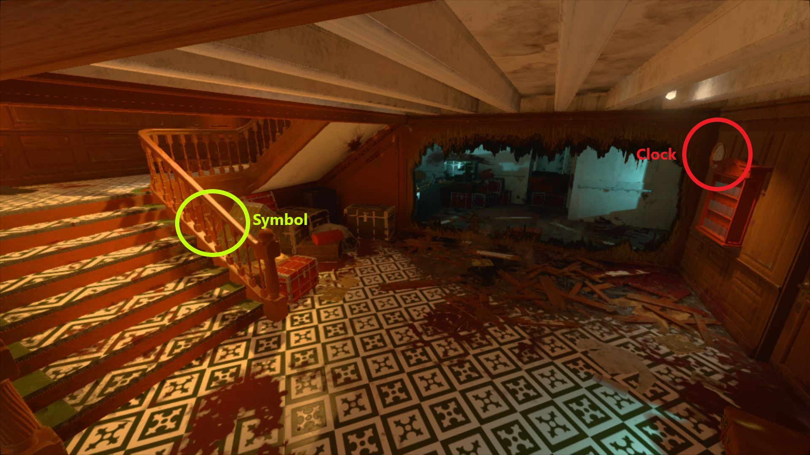</imageLink>  丨  <videoLink title="视频教程"><source src="./video/time6.mp4"/></videoLink>
### 刻度盘的位置
1. 舰桥室
    - 在舰桥室的最远点。露天的房间里。 船舵旁边有四个刻度盘。
    - 刻度盘标有适当的符号，因此请检查每个刻度盘的每一侧，并将刻度盘的表面与符号相匹配。
    - <imageLink title="对应图片位置">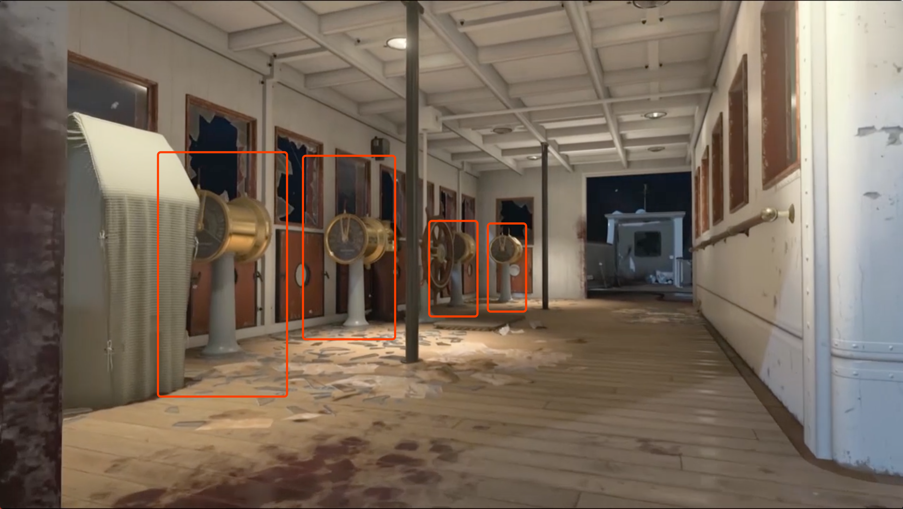</imageLink>  丨  <videoLink title="视频教程"><source src="./video/min-set.mp4"/></videoLink>
2. 船尾甲板
    - 在神器最初的地方，会有一个船舵，上面覆盖了大量的粘液和两个刻度盘。
    - 左边的刻度盘代表了气元素（带杠正三角）. 右边的刻度盘代表了土元素（带杠负三角）
    - <imageLink title="对应图片位置"></imageLink>  丨  <videoLink title="视频教程"><source src="./video/hour-set.mp4"/></videoLink>
3. 引擎室
    - 在奥丁神像前面的楼梯底部。
    - 杆子上有四个刻度盘。左上方和右下方的刻度盘可以看见被损坏。剩余一个完好的左下角与火元素符号（正三角）相对应。另外一个完好的右上角与水元素符号（负三角）相对应。
    - <imageLink title="对应图片位置"></imageLink>  丨  <videoLink title="视频教程"><source src="./video/hour-set2.mp4"/></videoLink>
### 时钟和符号
#### 寻找符号
一旦您第一次激活神器，一系列符号将出现在地图的四个位置。 这些位置是从六个位置中随机选取的。

为了通过这个步骤，你必须找到所有四个符号，这通常是指炼金术士符号中的火、水、空气和土元素。
#### 设置刻度盘
找到所有四个符号后，你必须找到“刻度盘”，并将刻度盘上拨成对应时钟上的读数。 你必须去舰桥，船尾甲板（神器初始位置），或引擎室。 在这些刻度盘上，你可以使用交互键来进行操作 (电脑键盘为`F`键)。 通过对准刻度盘的右侧按互动键，可以将指针拨到右侧将使时间增加。 在使用分钟的刻度盘上，移动一格为5分钟。 在使用时钟的刻度盘上，移动一格为1小时。 按照下面的相关指南或<videoLink title="视频教程"><source src="./video/set-helper.mp4"/></videoLink>来解决每个位置的调整问题。
#### 舰桥室
仔细检查舰桥室的每一个圆柱。 你会发现每个圆柱上都有一个刻度盘，刻度盘上都有不同的符号。 这些刻度盘代表着时钟上的 分针。 只需将正确的刻度设置为相关时钟上的分钟数即可。

举个栗子： 如果您的火元素（正三角）的钟读数为3:55，请将刻度盘上的拉杆向左移动一次。
#### 船尾甲板
只有两个未标记的刻度盘在神器出生的同一地点（小道上） 左边的刻度盘代表着时钟上的 时针 ，代表的元素符号为气元素（带杠正三角）. 右边的刻度盘代表着时钟上的 时针 ，代表的元素符号为土元素（带杠负三角）. 
#### 引擎室
在奥丁祭坛前的楼梯上，你会看到最后两个刻度盘。 虽然管道上有四个刻度盘，但只有左下和右上可以移动（其余两个损坏了）。 左下角的刻度盘代表着时钟上的 时针 ，代表的元素符号为火元素（正三角）. 右上角的刻度盘代表着时钟上的 时针 ，代表的元素符号为水元素（负三角）. <imageLink title="参考截图"></imageLink>
#### 确保检查
当你听到一个巨大的且不祥的声音，而且刻度不能再调节的时候， 代表着这个步骤已经完成了，你可以移动到下一步：“插座”步骤。
## 插座
查看[插座和传送门](#插座和传送门) 版块以获得更多关于完成插座步骤的信息

<vodOutlet/>

::: danger
你**必须**按照特定的顺序来使用插座创建的传送门入口。
1. 酸(毒气)
2. 水
3. 电
4. 火
:::
### 位置
进行步骤需要的插座会在六个位置中的四个位置出现。 这些插座将在所定位置上一直存在，但是它们不会都处于彩蛋步骤需要的“激活状态”。 你将会发现哪些是已经处于激活状态的插座，已经激活的插座会间断地泄露出上面列表中的一种元素。 查看[插座和传送门](#插座和传送门)版块以获得更多信息.
1. 高级包房
- 从出生地进入后左侧的一组房间. 在一些没有挂起的画旁边. 在Saug购买点后面的房间里.
- <imageLink title="对应图片位置"></imageLink>  丨  <videoLink title="视频教程"><source src="./video/1.mp4"/></videoLink>
2. 大楼梯顶层
- 最上层. 在时钟和时钟对应符号之间. 在spitfire购买点前面.
- <imageLink title="对应图片位置"></imageLink>  丨  <videoLink title="视频教程"><source src="./video/2.mp4"/></videoLink>
3. 餐厅
- 拉神像的左侧. 在一面非常小的墙的另一面.
- <imageLink title="对应图片位置"></imageLink>  丨  <videoLink title="视频教程"><source src="./video/3.mp4"/></videoLink>
4. 头等舱休息室
- 在宙斯神像左侧的支撑柱上.
- <imageLink title="对应图片位置"></imageLink>  丨  <videoLink title="视频教程"><source src="./video/4.mp4"/></videoLink>
5. 船尾甲板
- 在一个神秘箱子的刷新点前面, 位于一扇被路障阻拦的门后, 在发电机的左边.
- <imageLink title="对应图片位置">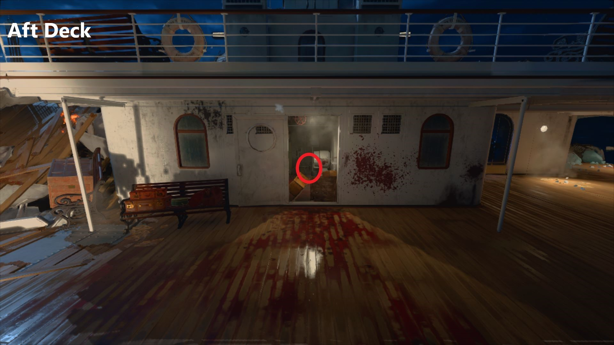</imageLink>  丨  <videoLink title="视频教程"><source src="./video/5.mp4"/></videoLink>
6. 三等舱卧铺
- 在尾楼甲板楼梯的底层. 左侧.
- <imageLink title="对应图片位置"></imageLink>  丨  <videoLink title="视频教程"><source src="./video/6.mp4"/></videoLink>
### 插座和传送门
#### 寻找插座
**此步骤必须在时钟步骤之后完成**。如果您没有完成时钟步骤，则插座不会被激活。

船上有六个隐藏的插座。 在彩蛋的这一部分，其中四个插座将喷出不同的元素。 他们分别是 毒、水、电、火 为了确定是否是你要的插座，您可能需要观察插座几秒钟。<videoLink title="视频教程"><source src="./video/plug.mp4"/></videoLink>
::: tip
如果你激活一个插座，所有其他插座在这一局都不能被激活，直到下一回合。
:::
#### 激活插座
为了激活一个插座，你必须在它前面杀死一个对应类型的元素僵尸。 例如，要激活火插座，你必须引诱一个火僵尸在插座前面，然后杀死它。

当你成功的激活插座之后，插座前面会出现一个法阵传送门。

每轮只能激活一个插座，一旦激活了一个插座，所有其他插座 将会无法继续激活，直到下一波。 激活所有四个插座后，可以继续下一阶段。
#### 进入封锁挑战
一旦所有插座都被激活，您将需要按特定顺序进入它们。 (**酸/毒液 -> 水 -> 电 -> 火**). 要激活，所有玩家必须站在传送门上并“按住”其互动键/按钮。 (键盘上为 F 键). 然后，玩家将被传送到船上的某一部分，所有出口都被封锁。 你和你的队伍将被封锁在这个区域，直到所有敌人都被杀死。

视频参考
1. <videoLink title="酸"><source src="./video/poison.mp4"/></videoLink>
2. <videoLink title="水"><source src="./video/water.mp4"/></videoLink>
3. <videoLink title="电"><source src="./video/eletrac.mp4"/></videoLink>
4. <videoLink title="火"><source src="./video/fire.mp4"/></videoLink>
::: tip
毒和电的封锁挑战都会提供一个Max Ammo（弹药全满），在挑战完成区域解锁之前都不会消失。
:::
一旦所有的敌人都击杀之后，门就会打开，神器就会漂浮在附近，需要再把它捡起来。
::: warning
 不要忘了拿起神器，否则你将不得不重新启动传送门，或者无法进入下一个挑战。
:::
一旦所有四个传送门都完成，您将准备进入下一步：给引擎室重新灌水。
## 元素蒸馏器
蒸馏器<imageLink title="可在工作台被组装">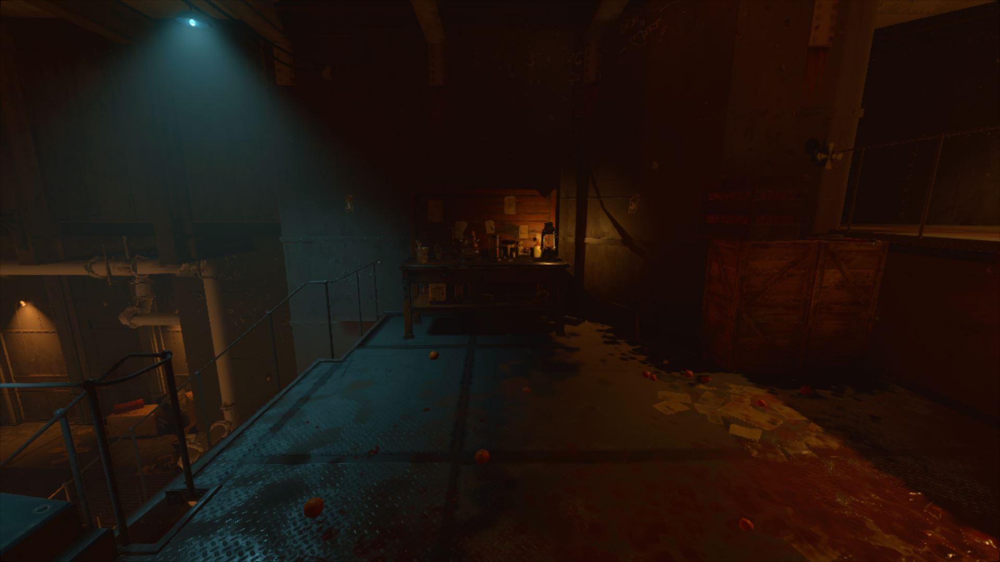</imageLink>可以为海怪提供元素强化的支持。 其中一种元素：酸（毒）的附加强化是完成主线彩蛋的必须步骤。 一共有三个部分，每个部分都有一组独特的刷新位置。 一旦收集齐3个不同的部件，蒸馏器就可以建在涡轮机房的上方工作台上。

### 位置
1. 部件1
- 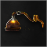
- <imageLink title="厨房">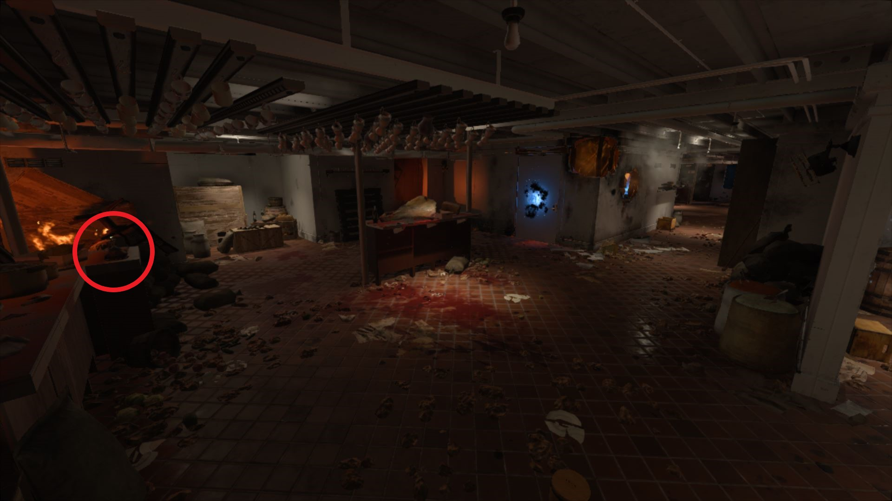</imageLink> - 从大旋梯/餐厅左侧进入时，在厨房门左侧， 放在火柜台上的小东西。
- 厨房 - 从大旋梯/餐厅右侧进入时，在厨房门右侧， 在最右边墙上的一组架子上。
2. 部件2
- 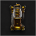
- 货仓 - 在货仓区域中央。在一堆燃烧的盒子和牛奶罐上。 它就在一个油灯的左边。
- <imageLink title="货仓"></imageLink>  - 在排水阀右侧。
3. 部件3
- 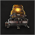
- <imageLink title="头等舱休息室"></imageLink>  - A 甲板. 在离开大旋梯时，穿过倒在地上的门。 蒸馏壶将放在 右手边 的第一张桌子上。
- <imageLink title="头等舱休息室"></imageLink>  - A 甲板. 在离开大旋梯时，穿过倒在地上的门。 壶将放在拐角处 左手边 的一张小桌子上。

一旦蒸馏器组装完成，你需要从元素僵尸身上收集元素器官。 要做到这一点，只需要用海怪杀死一只元素僵尸，就会掉落相应的元素器官。 当然，不是每个元素物品都是100%掉落，可能你需要多杀几个，这个看脸。 当你捡起了对应元素僵尸的掉落物后，可以在物品栏看到。

::: tip 元素掉落物
- 火僵尸 - <imageLink title="浓缩等离子体">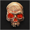</imageLink>
- 酸液/毒僵尸 - 浓缩腐化(这个掉落物是完成 管道 主线任务 彩蛋的必须步骤)
- 水僵尸 - <imageLink title="浓缩净化">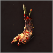</imageLink>
- 电僵尸 - <imageLink title="浓缩辐射"></imageLink>
:::

## 管道
在进行这一章节之前，您将需要一个用酸性元素升级的海怪。 查看[蒸馏器](#元素蒸馏器)章节来了解更多关于强化海怪的信息。

一旦你获取了恢复正常的神器，你就需要前往涡轮机房。 这里将有9个蓝色管道，其中一个或两个在发生泄漏。 最初，这些泄漏只会喷出蒸汽。 但是，一旦你用酸液强化的海怪射击它们，它们会开始喷水，并在准心出现击中提示。 在所有九个都被射击后，房间将开始震动并再次被洪水淹没。

接下来，您需要等待房间重新灌满水后，进入下一波，强化机会被移动回涡轮机房。 然后，你就可以对神器进行强化，完成这个彩蛋的步骤。

## 行星
在这一章节中,你需要找到包括代表了7个行星、太阳和月球 的9个星球符号。

一旦你找齐了代表了9个星球的符号, 你需要到达货仓区域 进行第二次排水（如果水未被排掉的话），和一个天文仪器互动 这个天文仪器位于<imageLink title="幽灵车互动">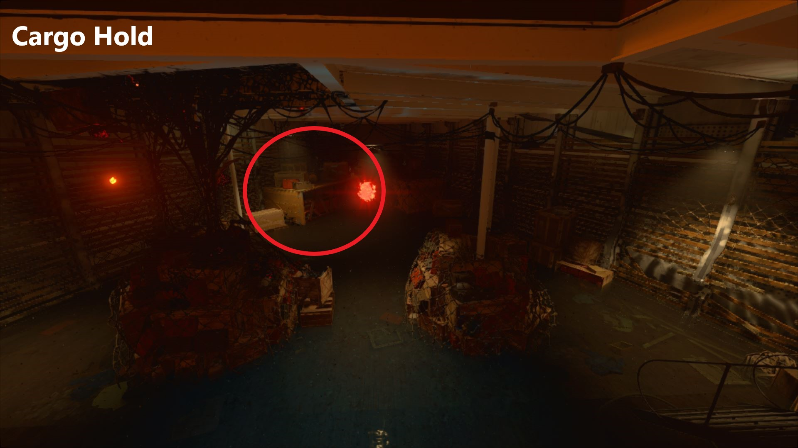</imageLink> 的[盾牌升级步骤](#升级盾牌(冰神守护))的左侧. 一旦与其互动，天文仪器上的星球将会按照顺序（每局游戏随机）亮起 你可以使用[行星顺序记录器](#行星顺序记录器)来记录行星亮起的顺序。 太阳一定会是最后一个亮起的。
::: warning
一旦你启动了天文仪器 僵尸会开始成群结队的出现并攻击玩家。 而且这些僵尸击杀之后不会给予分数（金钱）奖励。
:::
一旦你完成了顺序的记忆，你的下一步就是根据 顺序在船上射击对应的星体。 射击星体后，星体发出光芒并掉落到对应行星符号的位置 你会有3分钟左右的时间赶到对应的位置来捡起这些行星精华。 同时，僵尸也会开始成群结队的刷新在精华掉落区域，同样的，击杀他们不会给你分数奖励。
::: danger
如果你没有及时赶到捡起精华，或者 你按照错误的顺序击落了错误的星球, 你就需要在下一波重新从天文仪器开始，但顺序还是一样。
:::
::: tip
除非你做好了准备，否则先不要射击最后的太阳。 建议先确认队伍中至少有一名玩家拥有控场道具或拉之权杖特殊武器。
:::

一旦你射击了太阳，所有玩家必须到达太阳精华落下的地方 所有玩家与其精华互动（长按F），然后进入破冰挑战。

冰块会将每个路口堵住，你必须以最快速度摧毁冰块，并到达船的另一边， 也就是神器刚开始出现的地方。

时间有限，剩余的时间越少，玩家的屏幕周围就会出现越严重的冰冻效果提示。 摧毁船尾的最后一块冰后，屏幕会闪白，然后最终BOSS决战的传送门会出现在最后一块冰 的正下方。

::: tip
这一步骤中使用拉之权杖射线射击冰块会有奇效。
 
建议不要将火力浪费在挖煤工或者瘟疫之父上，让你的盾牌来吸收来自他们的伤害。
:::
::: tip
其中一块冰会掉落一个Max Ammo（弹药全满），如果需要的话，记得留一位玩家在后面拾取。
:::
::: danger
如果你没有在限制的时间内摧毁最后一块冰，屏幕会闪白且可以听到失败的声音。你需要在下一回合回到船头与太阳精华互动才能重新开始。
:::
### 行星顺序记录器
点击并拖动两个列表之间的行星来记录其顺序 为了方便起见，行星是按顺序进行排列的 太阳由于一定是在最后一个，所以固定排在最后。 使用 重置按钮 来重置它们的排序。

## 防弹盾

## 升级盾牌(冰神守护)

